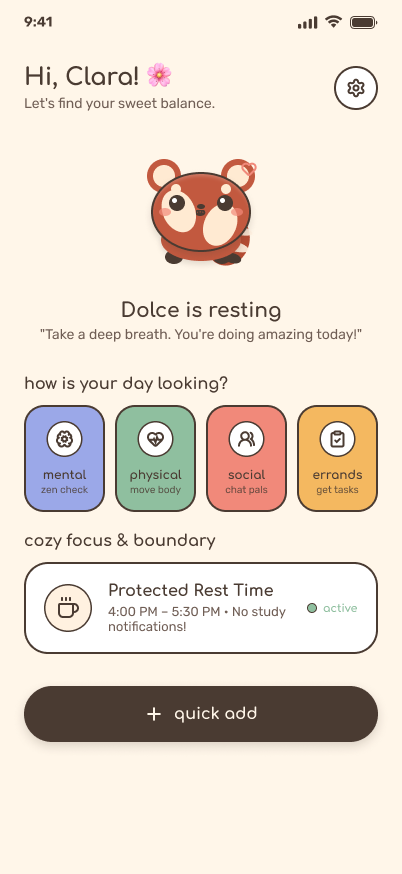
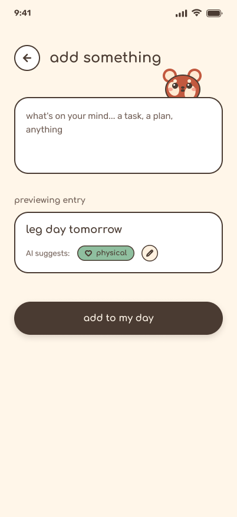

# dolce 🌸
*Eliminating the Mental Load*

A lifestyle and personal productivity application designed to eliminate student burnout through balanced workload tracking across five dimensions: **Mental**, **Time**, **Physical**, **Social**, and **Errands**.

## 📱 Prototype Screens

### Home View

### Quick-Add Input

## 🧠 Ideation & Process

### Ideas We Considered

| Idea | Why it was dropped / kept |
| --- | --- |
| **Dolce — guardian companion + effortless AI-classified load tracking** (Chosen) | Solves the core insight: existing tools (Notion, calendars) demand effort from an already-overwhelmed user. Dolce removes that effort by auto-classifying input and acting on it. |
| Basic stress-tracking dashboard (numeric score) | Dropped — this is what the brief explicitly warns against ("shouldn't just track and report"). A number doesn't tell a student what to do, and doesn't create emotional engagement to return to the app daily. |
| Treating Time as a 5th user-tagged category | Dropped mid-process — asking the user to log/categorize time themselves reintroduces the manual-effort problem we're trying to solve. Time works better as something the app watches structurally (overlaps, deadline stacking) rather than something the user inputs. |
| Full custom AI-generated human cartoon mascot (gender-selectable, multiple expression states) | Considered and partly built, but dropped for the prototype phase — maintaining consistent multi-expression human artwork ate significant time relative to its scoring weight (Design is only 10%). Switched to a red panda mascot for easier visual consistency. |

### Iteration Story

**Version 1 — abstract icon guardian.** We first designed the companion as a plain moon/crescent icon reflecting wellbeing state. Fast to build but cold — it read as a status icon, not a character.

**Version 2 — human cartoon mascot (gender-selectable).** We explored a girl/boy cartoon character the user picks at onboarding. Strong personality, but maintaining two full character variants across multiple emotional states would take real production time we don't have before the prototype deadline.

**Version 3 (current) — red panda mascot.** We simplified to a single, gender-neutral red panda character, keeping the warmth of the human concept with far less production overhead. It's now our app icon and in-app companion, unifying the brand.

**Dropped: multi-state AI-generated art.** We attempted generating distinct mood-state illustrations (celebrating, tired, resting) using AI image tools. This proved time-intensive to keep consistent under deadline pressure. For the prototype we're shipping one calm baseline expression, with mood-reactive states planned as a Building Phase enhancement.

### Breadth of Exploration

Before settling on a mobile app, we briefly considered a browser extension and a physical/paper planner insert. Both were dropped quickly: a browser extension misses the physical/social/errand dimensions of burnout (most of that load happens away from a laptop), and a paper planner can't do AI classification, reminders, or protected-time defense. A mobile app was the only option that could unify all five load dimensions.

## 🛠️ Technical Architecture & Feasibility

**Tech stack**

- **Frontend:** Flutter, targeting Android first. Supports iOS later from the same codebase, but building Android-only now avoids needing macOS/Xcode/an Apple Developer account.
- **Backend:** Firebase — Firestore (logged items, sleep, calendar data), Firebase Auth, Cloud Functions (AI classification calls, overlap checks), Firebase Cloud Messaging (notifications). Chosen to avoid managing our own server given the timeline.
- **AI classification:** Claude API — a single-purpose call classifying quick-add text into Mental/Physical/Social/Errands (user can correct it). No custom ML training needed, realistic for our timeframe.
- **Sleep tracking:** manual input for MVP; Apple Health/Google Fit integration planned as a future enhancement.

**Build plan & scope**

*MVP:* quick-add logging with AI classification, manual sleep logging, calendar overlap/deadline warnings, one protected Dolce Block per day, basic Pomodoro timer, single-state red panda companion.

*Future:* multiple mood-reactive companion states, wearable integration, personalized habit learning, iOS build.

## 💡 Why Dolce Is Different

| Existing solution | Where it falls short |
| --- | --- |
| **Notion / calendar apps** | Require the user to build and maintain the system themselves — for someone already burned out, that setup effort is itself a barrier. |
| **Stress-tracking / mood apps** | Report a score but don't act on it or reduce user effort. |
| **Generic to-do apps** | Treat all tasks the same — no load-type distinction, no protected rest. |
| **Dolce** | Takes messy, low-effort input and organizes, warns, and protects for the user, with a companion that makes rest feel rewarding. |

This project started from personal experience — one of our team members struggles with burnout and finds existing organizational tools like Notion themselves a source of overwhelm. Dolce is built to solve that specific gap.

## 🤝 Mentor Consultation

| Date | Mentor | Feedback Received | What Was Changed |
| --- | --- | --- | --- |
| 13/9/2026, 21:15 | *[mentor name]* | Pointed out that our feature list didn't clearly cover the calendar/Time-management side of the app, and advised us to add more standout features to differentiate Dolce further. | Clarified Time as its own structural feature — Dolce watches the calendar in the background for overlapping bookings and deadline stacking, rather than treating it as a user-logged category. We also expanded on our standout features (Dolce Blocks, Pomodoro sessions, and AI auto-classification) in the README to make the differentiation clearer. |
